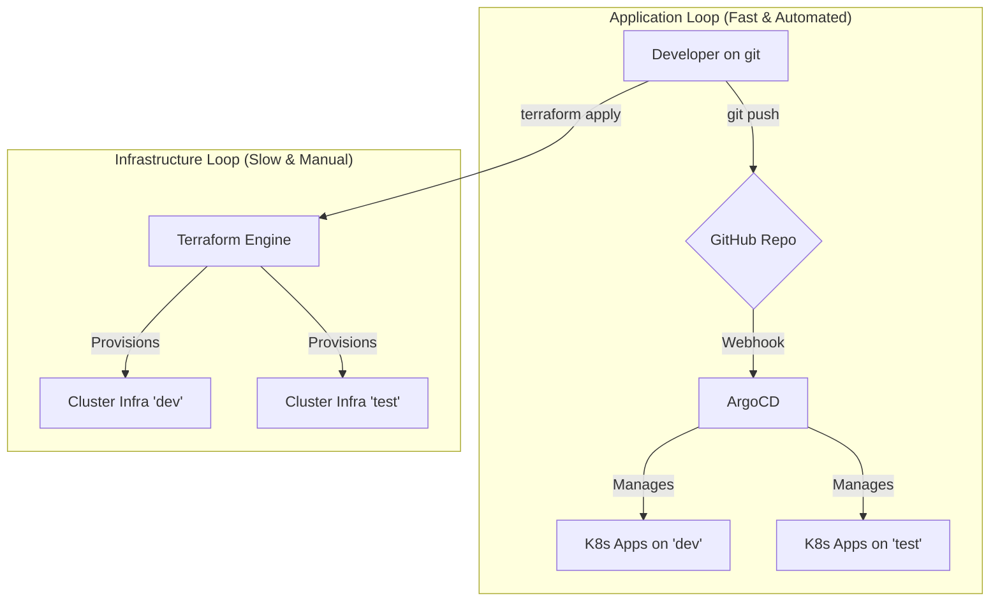

# Vixens GitOps Project

## 1. Description

Infrastructure GitOps pour le déploiement et la gestion de clusters Kubernetes basés sur Talos Linux. Le projet couvre le cycle de vie complet, du provisionnement de l'infrastructure avec Terraform à la gestion des applications avec ArgoCD.

## 2. État Actuel

**Phase Actuelle :** Phase 1 - Création du code Terraform pour le provisionnement du cluster `dev`.

**Objectif en cours :** Voir `OBJECTIF-01` dans le fichier [DEFINITIONS.md](./DEFINITIONS.md).

## 3. Schéma d'Architecture

Ce schéma illustre les deux boucles de contrôle du système : la boucle d'infrastructure (manuelle, via Terraform) et la boucle applicative (automatisée, via ArgoCD).

## 4. Navigation

Pour comprendre le fonctionnement de ce projet, veuillez consulter les documents suivants dans l'ordre :

1.  **[PRINCIPLES.md](./PRINCIPLES.md)**: La constitution et les règles philosophiques du projet.
2.  **[docs/WORKFLOW.md](./docs/WORKFLOW.md)**: Le processus Git (branches, commits, PRs).
3.  **[docs/CONVENTIONS.md](./docs/CONVENTIONS.md)**: Les règles de style pour le code Terraform et Kubernetes.
4.  **[DEFINITIONS.md](./DEFINITIONS.md)**: Le backlog de tous les objectifs du projet.
\nThis is a test change for PR validation.
