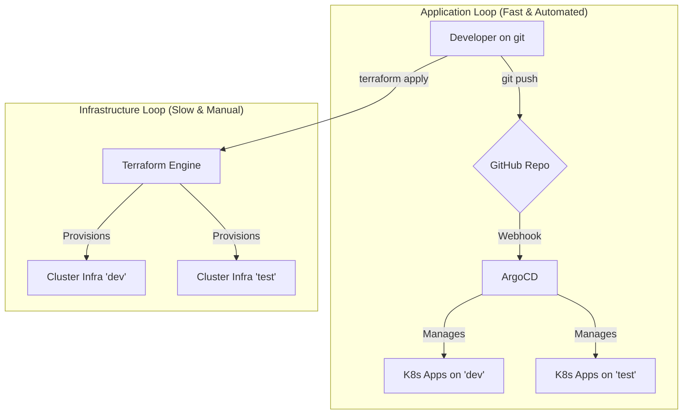

# Vixens GitOps Project

## 1. Description
Infrastructure GitOps pour le déploiement et la gestion de clusters Kubernetes basés sur Talos Linux. Le projet couvre le cycle de vie complet, du provisionnement de l'infrastructure avec Terraform à la gestion des applications avec ArgoCD.

## 2. Quick Start

### Prerequisites
- [Terraform](https://www.terraform.io/downloads.html)
- [kubectl](https://kubernetes.io/docs/tasks/tools/install-kubectl-linux/)
- [talosctl](https://www.talos.dev/v1.6/introduction/getting-started/#talosctl)

### Installation & Usage
1. Clone the repository:
   ```bash
   git clone https://github.com/charchess/vixens.git
   cd vixens
   ```

2. Navigate to the `dev` environment directory to configure it if needed:
   ```bash
   cd terraform/environments/dev
   # Create or review terraform.tfvars
   ```

3. From the project root, initialize and apply Terraform for the `dev` environment:
   ```bash
   terraform -chdir=terraform/environments/dev init -upgrade
   terraform -chdir=terraform/environments/dev apply -auto-approve
   ```

## 3. Project Status
**Current Phase:** Phase 2 - GitOps services deployment.

## 4. Architecture Overview
This diagram illustrates the two control loops: the infrastructure loop (manual, via Terraform) and the application loop (automated, via ArgoCD).



## 5. Documentation
Project documentation has been migrated to the OpenSpec standard.
- **Project Overview**: See `openspec/specs/project/spec.md`
- **Technical Architecture**: See `openspec/specs/infrastructure/spec.md`
- **Development Workflow**: See `openspec/specs/workflow/spec.md`