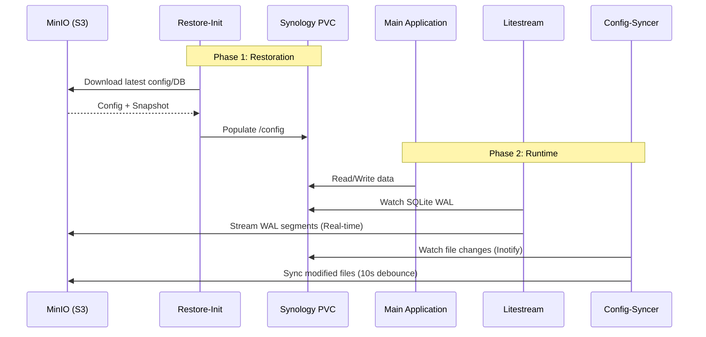

# <!-- Powered by BMAD™ Core -->
# Vixens Infrastructure Brownfield Enhancement Architecture

**Version:** 4.0  
**Status:** Approved / Real-world Reference  
**Project:** Vixens Cluster Stabilization & Goldification  

---

## 1. Introduction & Existing Project Analysis

### 1.1 Introduction
This document defines the architectural approach for standardizing the Vixens cluster to the **"Elite" conformity level**. Its primary goal is to resolve existing "OutOfSync" and "Unknown" states in ArgoCD by industrializing application durability (via Litestream and Config-Syncer) and resource management.

### 1.2 Existing Project Analysis
- **Primary Purpose:** Multi-cluster Kubernetes homelab infrastructure (GitOps "State Repo").
- **Current Tech Stack:** 
    - **Platform:** Talos Linux v1.12.2 / K8s v1.34.0.
    - **Network:** Cilium (CNI) + AdGuard Home (Internal DNS HA).
    - **Storage:** Synology CSI (iSCSI/NFS).
    - **Secrets:** Infisical Operator (Injector for storage & app secrets).
    - **GitOps:** ArgoCD v7.7.7 using a Trunk-based workflow (main branch).

**Key Findings:**
- **Durability Gaps:** Many SQLite-based applications lack continuous replication, leading to data loss risks during node failures.
- **Resource Drift:** Inconsistent probes and missing resource limits are causing intermittent restarts in core services like `external-dns` and `adguard-home`.

---

## 2. Enhancement Scope and Integration Strategy

### 2.1 Enhancement Overview
The "Goldification" campaign targets 100% compliance with the Elite standard across all application categories (`media`, `network`, `infra`).

### 2.2 Integration Strategy: The "Elite" Pattern
- **Recovery-First Pattern:** Applications must verify and restore their state via initContainers (`rclone` for static files, `litestream` for DBs) before the main process starts.
- **Sidecar Durability:** Every Elite pod includes a `litestream` sidecar for real-time DB replication and a `config-syncer` sidecar for inotify-driven file sync to MinIO.
- **Kyverno Enforcement:** Use Kyverno policies to monitor compliance and automatically flag non-Elite deployments.

---

## 3. Tech Stack

| Category | Technology | Usage |
| :--- | :--- | :--- |
| **Backup (DB)** | Litestream v0.5.6 | Sidecar for real-time SQLite replication to MinIO. |
| **Backup (Files)** | rclone + inotify | Sidecar (Config-Syncer) for static file sync. |
| **Storage Backend** | MinIO | S3-compatible internal endpoint hosted on Synology. |
| **Secrets Management**| Infisical | Automatic injection of S3 credentials. |
| **Validation** | Python / Beads | `conformity_checker.py` and Beads status tracking. |

---

## 4. Component Architecture

### 4.1 Pod Topology (Elite Standard)
Every Elite Deployment is composed of:
1.  **Main Application:** The core service.
2.  **Litestream Sidecar:** Listens on port `9090` for metrics.
3.  **Config-Syncer Sidecar:** Watches `/config` for changes (excluding DB files).
4.  **Restore InitContainer:** Pulls the latest stable state from MinIO.

### 4.2 Internal DNS HA (AdGuard)
To resolve query bursts and failures:
- **HA Replicas:** Maintain 2 replicas with Kyverno health-check triggers.
- **Upstream Link:** Standardize CoreDNS forwarders to minimize latency between AdGuard and the upstream providers.

### 4.3 Data Lifecycle Flow (Mermaid)
This diagram illustrates the sequence from Pod initialization to continuous protection:



---

## 5. Source Tree Integration

The architecture uses a modular **Kustomize Component** approach:

```plaintext
apps/_shared/components/
├── elite-standard/      # Probes (Liveness/Readiness), Resource Limits
├── elite-litestream/    # Litestream config, sidecar, and restore init
└── elite-syncer/        # rclone-based config-syncer
```

**Implementation Rule:** Applications in `apps/` include these components in their `base/kustomization.yaml` to inherit the Elite features without duplicating manifests.

---

## 6. Coding Standards (Elite Baseline)

### 6.1 Resource Limits
- **Memory:** `Request == Limit` to prevent silent OOMKills.
- **CPU:** `Request` set to 10-25% of `Limit` to allow bursts during startup/indexing.

### 6.2 Probes
- **Startup Probes:** Mandatory for heavy apps (Java/Python) to allow long boot times (up to 180s) without triggering restart loops.
- **Liveness Probes:** Standardized to 3 failures before restart.

### 6.3 Elite Operational Baselines (Alerting & Sizing)
To ensure the "Elite" status is not just a configuration but a functional reality, the following thresholds and standards from `docs/reference/RESOURCE_STANDARDS.md` are enforced:

**A. Monitoring & Alerting (Prometheus):**
- **Litestream Sync Lag:** Critical alert if `litestream_sync_count` has not increased for > 5 minutes.
- **Config-Syncer Failures:** Warning if `rclone` container restarts > 3 times in 1 hour.
- **Persistence Latency:** Critical alert if I/O wait on Synology PVCs exceeds 500ms for more than 2 minutes.

**B. Elite T-Shirt Sizing & QoS Policy:**
Elite applications MUST use standardized sizing but with a **Guaranteed QoS** strategy for memory to ensure stability:

| Elite Size | CPU (Req / Lim) | RAM (Req / Lim) | Usage Typique |
| :--- | :--- | :--- | :--- |
| **Micro** | `10m` / `100m` | `128Mi` / `128Mi` | Sidecars (Litestream, Syncer) |
| **Small** | `50m` / `500m` | `512Mi` / `512Mi` | Apps Go/Rust, Outils statiques |
| **Medium** | `200m` / `1000m` | `1Gi` / `1Gi` | Web Apps (Python/Node) |
| **Large** | `1000m` / `2000m` | `4Gi` / `4Gi` | Databases, Heavy Apps (Jellyfin) |

**C. Sizing & Priority Rules:**
- **Guaranteed Memory:** For Elite status, **Memory Limit MUST equal Memory Request**. This eliminates OOMKill risks due to node overcommitment.
- **Burstable CPU:** We maintain `Request < Limit` for CPU (typically 10-25% ratio) to allow burst performance while ensuring base scheduling.
- **Elite Priority Classes:**
    - **`vixens-critical` (100k):** Reserved for Core Infrastructure (Ingress, CSI, Infisical, ArgoCD). Elite apps in this category are non-evictable.
    - **`vixens-high` (50k):** Required for Mission-Critical User Apps (Home Assistant, AdGuard, Vaultwarden).
- **Enforcement:** Any application claiming "Elite" status that uses `vixens-medium` or `vixens-low` will be flagged as non-compliant in conformity reports.
- **Sidecar Overhead:** Budget an additional `20m CPU` and `128Mi RAM` per pod for the combined Litestream and Config-Syncer sidecars.
- **Namespace Quotas:** The `00-infra` (MinIO) namespace must have a high priority class to prevent eviction during cluster-wide backup bursts.

---

## 7. Testing & Validation Strategy

### 7.1 Post-Deployment Validation
Every deployment must be followed by:
1.  `just wait-argocd <app>`: Confirm Healthy/Synced state.
2.  `python3 scripts/validation/validate.py <app> dev`: Real-world connectivity check.
3.  `just reports`: Update the conformity dashboard in `docs/reports/`.

---

## 8. Next Steps

1.  **Story 1.1:** Resolve `Unknown` states for `frigate` and `sonarr` using the new Elite Probes.
2.  **Story 1.2:** Standardize `litestream-config.yaml` for all media apps using the shared component.
3.  **Story 1.3:** Implement AdGuard HA monitoring via Kyverno.

---
🏗️ *Drafted by Winston (BMad Architect) based on Vixens Cluster Analysis.*
