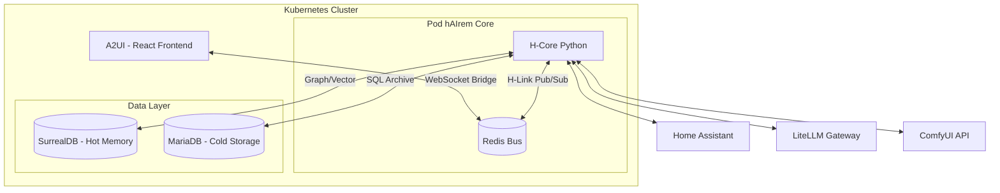

# hAIrem Fullstack Architecture Document

**Version:** 4.2 (Final Consolidated)  
**Status:** Finalized & Verified  
**Author:** Winston (Architect)  

---

## 1. Introduction
hAIrem est un framework d'écosystème d'agents spécialisés, incarnés et inter-agentifs. Il repose sur un modèle d'**Orchestrateur Léger** (Thin Orchestrator) où la logique de coordination est centrale tandis que les ressources lourdes (LLM, Image Gen) sont déportées.

---

## 2. Architecture de Haut Niveau (High Level Architecture)

### Technical Summary
Le système est un monolithe logique déployé sur **Kubernetes**. Le cœur (**H-Core**) en Python asynchrone utilise **Redis** pour la communication inter-agents et **SurrealDB** pour une mémoire multi-modèle (Graphe/Vecteur).

### Architecture Diagram

---

## 3. Tech Stack
*   **Backend:** Python 3.11+ (FastAPI/Asyncio).
*   **Bus:** Redis 7.x (Streams/Pub-Sub).
*   **Bases de données:** SurrealDB (Principal), MariaDB (Historique).
*   **Inférence:** LiteLLM (Hybrid Cloud/Local via Ollama).
*   **Infrastructure:** Kubernetes avec stockage iSCSI (Performance) et NFS (Assets).

---

## 4. Modèles de Données & Mémoire Subjective
Le framework implémente une **Mémoire Dynamique Pondérée (MDP)**.
*   **Raw Events:** Faits bruts immuables partagés par tous.
*   **Agent Memory:** Fragments d'interprétation subjectifs propres à chaque agent (indexés par UUID).
*   **Supersedance:** Gestion de versioning via `replaces_id` pour corriger ou mettre à jour les informations.
*   **Decay & Synthesis:** Érosion mathématique des souvenirs et compression nocturne des fragments denses.

---

## 5. Protocole H-Link (Redis JSON)
Format standard de message incluant :
*   `header`: msg_id, parent_id, timestamp, sender, type (RAW/SUBJECTIVE/STREAM/DIRECTIVE), priority (P0-P3).
*   `payload`: content, data, metadata (confidence, importance, pose_hint).

---

## 6. Orchestration Narrative
*   **Dieu (Régisseur d'Entropie):** Plug-in de type `ENTROPY_AGENT`. Murmure (`whisper`) aux autres agents pour injecter du chaos, des hallucinations ou des maladresses.
*   **Dream (Consolideur):** Processus nocturne de maintenance (Decay, Archivage MariaDB, Synthèse LLM Lite).
*   **Gouverneur de Sécurité:** Inhibition automatique de l'entropie lors de messages de priorité P0 (Urgence).

---

## 7. Système Hotplug & Plugins
Les agents sont des dossiers autonomes chargés dynamiquement :
*   **Structure:** `agent.yaml` (contrat), `logic.py` (outils), `/assets/` (visuels/audio).
*   **Gatekeeper:** Vérification de conformité (schéma, syntaxe, ressources) avant activation.
*   **Object Context (ctx):** Interface sécurisée injectée dans les outils (accès HA, Memory, Bus, Logger).

---

## 8. Résilience & Déploiement
*   **Isolation:** Experts isolés par thread/processus dans le H-Core.
*   **Backup:** Snapshots iSCSI horaires + Exports SQL journaliers vers S3/NFS.
*   **Hot-Reload:** Rechargement des agents sans interruption du bus Redis.

---

## 9. Coding Standards & Security Rules
*   **Isolation :** Seul l'objet `ctx` est autorisé pour les interactions système.
*   **Asynchronicité :** Obligation d'utiliser `async def`.
*   **Intégrité :** Immuabilité des faits bruts (`raw_event`).

---

## 10. Gatekeeper Specs
Validation en 4 étapes : Manifeste, Assets, Logique (analyse statique), Heartbeat (Hash).

---

## 11. Dynamic Configuration
Piloté par `config/system.yaml`. Gère le Gouverneur P0 et les paramètres d'Entropie.

---
*Documented by Winston, Fullstack Architect (BMAD™ Core)*
