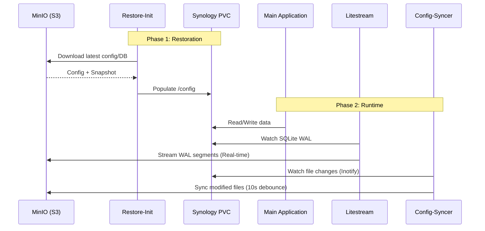

# <!-- Powered by BMAD™ Core -->
# Vixens Infrastructure Brownfield Enhancement Architecture

**Version:** 5.0  
**Status:** Approved / Real-world Reference  
**Project:** Vixens Cluster Stabilization & Goldification  

> **⚠️ Système de maturité:** Voir [ADR-023: 7-Tier Goldification System v2](adr/023-7-tier-goldification-system-v2.md)

---

## 1. Introduction & Existing Project Analysis

### 1.1 Introduction
This document defines the architectural approach for standardizing the Vixens cluster through the **7-tier Goldification system** (ADR-023). Its primary goal is to resolve existing issues (restarts, policy violations) by industrializing application durability (via Litestream and Config-Syncer) and resource management.

### 1.2 Existing Project Analysis
- **Primary Purpose:** Multi-cluster Kubernetes homelab infrastructure (GitOps "State Repo").
- **Current Tech Stack:** 
    - **Platform:** Talos Linux v1.12.4 / K8s v1.34.0.
    - **Network:** Cilium (CNI) + AdGuard Home (Internal DNS HA).
    - **Storage:** Synology CSI (iSCSI/NFS).
    - **Secrets:** Infisical Operator (Injector for storage & app secrets).
    - **GitOps:** ArgoCD v3.3.3 using a Trunk-based workflow (main branch).

**Key Findings (2026-03-08):**
- **Durability Gaps:** Many SQLite-based applications lack continuous replication → Blocage niveau Emerald (317 violations check-backup).
- **Resource Drift:** Probes manquants, PDB absents → Blocage niveau Platinum (237 violations check-pdb).
- **Security Gaps:** SecurityContext non durci → Blocage niveau Diamond (121 violations).

---

## 2. Enhancement Scope and Integration Strategy

### 2.1 Enhancement Overview
The "Goldification" campaign targets progressive compliance with the 7-tier system:

| Tier Cible | Prérequis Clé | Apps Actuelles |
|------------|---------------|----------------|
| 🥉 Bronze | Déployée, requests définis | 3 |
| 🥈 Silver | Limits, probes, TLS, secrets | 17 |
| 🥇 Gold | Métriques, Goldilocks, sync-wave | 48 |
| 💎 Platinum | PriorityClass, PDB, graceful shutdown | 17 |
| 🟢 Emerald | Litestream, Config-Syncer, Velero | 0 |
| 💠 Diamond | PSA, NetworkPolicies, SSO | 0 |
| 🌟 Orichalcum | 7j stabilité, 0 CVE | 0 |

### 2.2 Integration Strategy: The Emerald Pattern (Data Durability)

Pour atteindre le niveau **Emerald** (niveau 5), les applications doivent implémenter:

- **Recovery-First Pattern:** Applications must verify and restore their state via initContainers (`rclone` for static files, `litestream` for DBs) before the main process starts.
- **Sidecar Durability:** Every Emerald pod includes a `litestream` sidecar for real-time DB replication and a `config-syncer` sidecar for inotify-driven file sync to MinIO.
- **Kyverno Enforcement:** Use Kyverno policies to monitor compliance and automatically flag non-compliant deployments.

---

## 3. Tech Stack

| Category | Technology | Usage |
| :--- | :--- | :--- |
| **Backup (DB)** | Litestream v0.5.6 | Sidecar for real-time SQLite replication to MinIO. |
| **Backup (Files)** | rclone + inotify | Sidecar (Config-Syncer) for static file sync. |
| **Storage Backend** | MinIO | S3-compatible internal endpoint hosted on Synology. |
| **Secrets Management**| Infisical | Automatic injection of S3 credentials. |
| **Validation** | Python / Beads | `evaluate_maturity.py` and Beads status tracking. |
| **Policy Enforcement** | Kyverno | Maturity checks automatisés. |

---

## 4. Component Architecture

### 4.1 Pod Topology (Emerald Standard)
Every Emerald Deployment is composed of:
1.  **Main Application:** The core service.
2.  **Litestream Sidecar:** Listens on port `9090` for metrics.
3.  **Config-Syncer Sidecar:** Watches `/config` for changes (excluding DB files).
4.  **Restore InitContainer:** Pulls the latest stable state from MinIO.

### 4.2 Internal DNS HA (AdGuard)
To resolve query bursts and failures:
- **HA Replicas:** Maintain 2 replicas with Kyverno health-check triggers.
- **Upstream Link:** Standardize CoreDNS forwarders to minimize latency between AdGuard and the upstream providers.

### 4.3 Data Lifecycle Flow (Mermaid)
This diagram illustrates the sequence from Pod initialization to continuous protection:


```mermaid
sequenceDiagram
    participant S3 as MinIO (S3)
    participant Init as Restore-Init
    participant PVC as Synology PVC
    participant App as Main Application
    participant LS as Litestream
    participant CS as Config-Syncer

    Note over Init, PVC: Phase 1: Restoration
    Init->>S3: Download latest config/DB
    S3-->>Init: Config + Snapshot
    Init->>PVC: Populate /config
    
    Note over App, CS: Phase 2: Runtime
    App->>PVC: Read/Write data
    LS->>PVC: Watch SQLite WAL
    LS->>S3: Stream WAL segments (Real-time)
    CS->>PVC: Watch file changes (Inotify)
    CS->>S3: Sync modified files (10s debounce)
```

---

## 5. Source Tree Integration

The architecture uses a modular **Kustomize Component** approach:

```plaintext
apps/_shared/components/
├── sync-wave/           # ArgoCD deployment ordering
│   ├── wave-1/          # Infrastructure secrets (before databases)
│   ├── wave-2/          # Databases (after secrets, before apps)
│   ├── wave-5/          # Network services (after databases, before apps)
│   └── wave-10/         # Standard applications (default layer)
├── goldilocks/          # VPA resource recommendations
│   └── enabled/         # Observation mode (no auto-apply)
├── revision-history-limit/ # ReplicaSet history limit (etcd optimization)
├── priority/            # PriorityClass (critical, high, medium, low)
├── poddisruptionbudget/ # PDB configurations (0, 1, 50percent)
├── probes/              # Health check templates (basic, advanced)
├── metrics/             # Prometheus scraping annotations
├── nometrics/           # Metrics exemption annotation
├── tolerations/         # Node affinity and tolerations
└── resources/           # Resource sizing templates
```

**Implementation Rule:** Applications in `apps/` include these components in their `base/kustomization.yaml` to inherit standardized features without duplicating manifests.

---

## 6. Coding Standards

### 6.1 Resource Limits (Silver+)
- **Memory:** `Request == Limit` recommandé pour éviter OOMKills (Guaranteed QoS).
- **CPU:** `Request` set to 10-25% of `Limit` to allow bursts during startup/indexing.

### 6.2 Probes (Silver)
- **Startup Probes:** Universel (bypass `vixens.io/fast-start: "true"` si démarrage < 5s).
- **Liveness Probes:** Standardized to 3 failures before restart.
- **Readiness Probes:** Mandatory for traffic routing.

### 6.3 Sizing Standards

| Size | CPU (Req / Lim) | RAM (Req / Lim) | Usage Typique |
| :--- | :--- | :--- | :--- |
| **Micro** | `10m` / `100m` | `128Mi` / `128Mi` | Sidecars (Litestream, Syncer) |
| **Small** | `50m` / `500m` | `512Mi` / `512Mi` | Apps Go/Rust, Outils statiques |
| **Medium** | `200m` / `1000m` | `1Gi` / `1Gi` | Web Apps (Python/Node) |
| **Large** | `1000m` / `2000m` | `4Gi` / `4Gi` | Databases, Heavy Apps (Jellyfin) |

### 6.4 Priority Classes (Platinum)

| Priority Class | Value | Usage |
|----------------|-------|-------|
| `vixens-critical` | 100000 | Core Infrastructure (Ingress, CSI, ArgoCD) |
| `vixens-high` | 50000 | Mission-Critical User Apps (Home Assistant, Vaultwarden) |
| `vixens-medium` | 10000 | Standard applications |
| `vixens-low` | 1000 | Non-critical, batch jobs |

---

## 7. Testing & Validation Strategy

### 7.1 Post-Deployment Validation
Every deployment must be followed by:
1.  `just wait-argocd <app>`: Confirm Healthy/Synced state.
2.  `python3 scripts/validation/validate.py <app> dev`: Real-world connectivity check.
3.  `just reports`: Update the conformity dashboard in `docs/reports/`.

### 7.2 Maturity Evaluation
```bash
# Évaluer la maturité d'une app
python3 scripts/evaluate_maturity.py <app> prod

# Générer le rapport de conformité
just reports
```

---

## 8. Current State & Next Steps

### État Actuel (2026-03-08)
- **Platinum atteint:** 17 apps
- **Gold atteint:** 48 apps
- **Blocage principal:** Backup (Emerald) - 0 apps

### Next Steps

1. **Implémenter Emerald pour apps critiques:**
   - homeassistant (16 restarts, besoin backup SQLite)
   - vaultwarden (données sensibles)
   - firefly-iii (finance)

2. **Résoudre instabilités:**
   - promtail (87 restarts) - investiguer OOM
   - netbird (42 restarts) - SecurityContext
   - vikunja (37 restarts) - root cause analysis

3. **Progresser vers Diamond:**
   - Implémenter NetworkPolicies Cilium
   - Durcir SecurityContext (121 violations actuelles)

---

## References

- [ADR-023: 7-Tier Goldification System v2](adr/023-7-tier-goldification-system-v2.md) — Source de vérité
- [STATUS.md](STATUS.md) — État actuel des applications
- [Quality Standards](reference/quality-standards.md) — Résumé des standards

---
🏗️ *Updated 2026-03-08 based on ADR-023 v2 and cluster state.*
